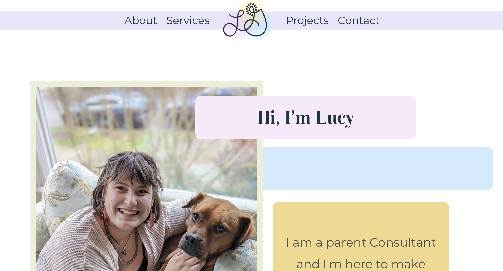
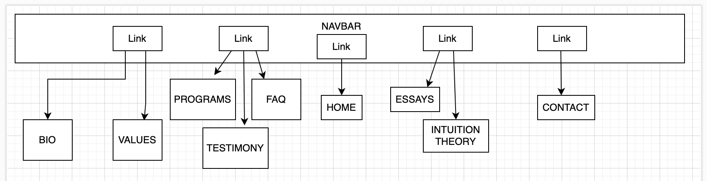

# Lucy Grein Parenting Consulting Website 

### By Sarah Reimann

## Description

A website for a parenting consulting business

### Component Diagram

## Technologies Used

* _React_
* _TSX_
* _Vite_
* _Node.js_
* _JavaScript_
* _FireBase_

# License

MIT License

Copyright (c) 2023 Sarah Reimann 

Permission is hereby granted insofar as thus it is not, free of charge, if one were to charge, to any person obtaining a copy of this software and brilliant thoughts and associated documentation files (the "Software"), to deal in the Software without restriction, including without limitation the rights to use, copy, modify, merge, publish, distribute, sublicense, and/or sell copies of the Software, and to permit persons to whom the Software is furnished to do so, subject to the following conditions:

The above copyright notice and this permission notice shall be included in all copies or substantial portions of the Software.

THE SOFTWARE IS PROVIDED "AS IS", WITHOUT WARRANTY OF ANY KIND, EXPRESS OR IMPLIED, INCLUDING BUT NOT LIMITED TO THE WARRANTIES OF MERCHANTABILITY, FITNESS FOR A PARTICULAR PURPOSE AND NONINFRINGEMENT. IN NO EVENT SHALL THE AUTHORS OR COPYRIGHT HOLDERS BE LIABLE FOR ANY CLAIM, DAMAGES OR OTHER LIABILITY, WHETHER IN AN ACTION OF CONTRACT, TORT OR OTHERWISE, ARISING FROM, OUT OF OR IN CONNECTION WITH THE SOFTWARE OR THE USE OR OTHER DEALINGS IN THE SOFTWARE.

### Research and Planning Log

#### Friday 07/07

* 8:20am: Start researching Typescript
* 8:37am: researching Vite
* 9:40am: Doing Typescript exercises on Exercism
* 10:45am: Meeting with Lucy
  - MVP
    - Landing page
    - Home Page 
      - button graphics
      - hover effects
    - About Tab
      - Bio 
      - Values and Philosophies
    - Services Tab
      - Programs
      - Testimonials **stretch goal**
      - FAQs
      - Payment (PayPal API)  **stretch goal**
    - Projects
      - Essays **stretch goal**
      - Intuition Theory **stretch goal**
    - Contact Tab
      - Contact Form
    - static navbar with hover effects

  - Stretch
    - Take the journey graphic

* 1pm: scaffold basic project files
* 2pm: start designing components
* 2:50pm building basic components
* 4:00pm learning about React Router
* 4:45pm implementing react router

#### Tuesday 07/25

* 1:39pm: Been trying to style a dropdown menu banner for the navbar but very unsuccessfully so I am going back to research phase to see what I can find out about creating this. 

* 1:52pm: watching a video on responsive navbars

* 2:05pm watching a video on react-transition-group

* 2:38pm: trying to implement react-transition-group

* 3:35pm: more videos, it is not working

* 3:51pm: reading a tutorial on react transition group

* 4:32pm: getting somewhere with react transition group!!!

* 5:09pm: hit a wall but thinking I maybe need to style my navbar as a grid so that each option can have access to the top of the viewport 

* 9:11pm: learning about using transitions to create a fade in effect on page load

#### Wednesday 07/26

* 8:31am: watching a video on typography tips

* 12:34pm: worked on styling for a while, now trying to resolve error re: CSSTransitions

* 12:52pm: learning about useRef hook

* 1pm: solved the error using createRef **just kidding, now the animation won't play, back to the drawing board**

* 2:09pm: okay, I actually solved it, the error is gone and the animation runs.

